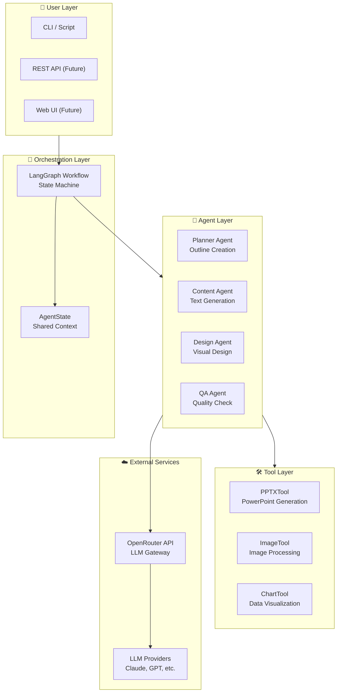
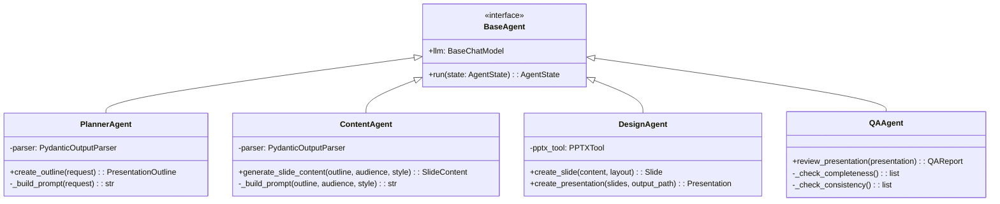
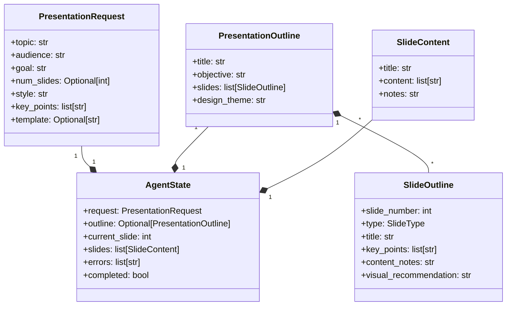
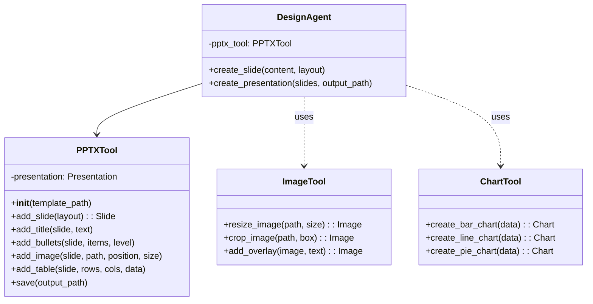
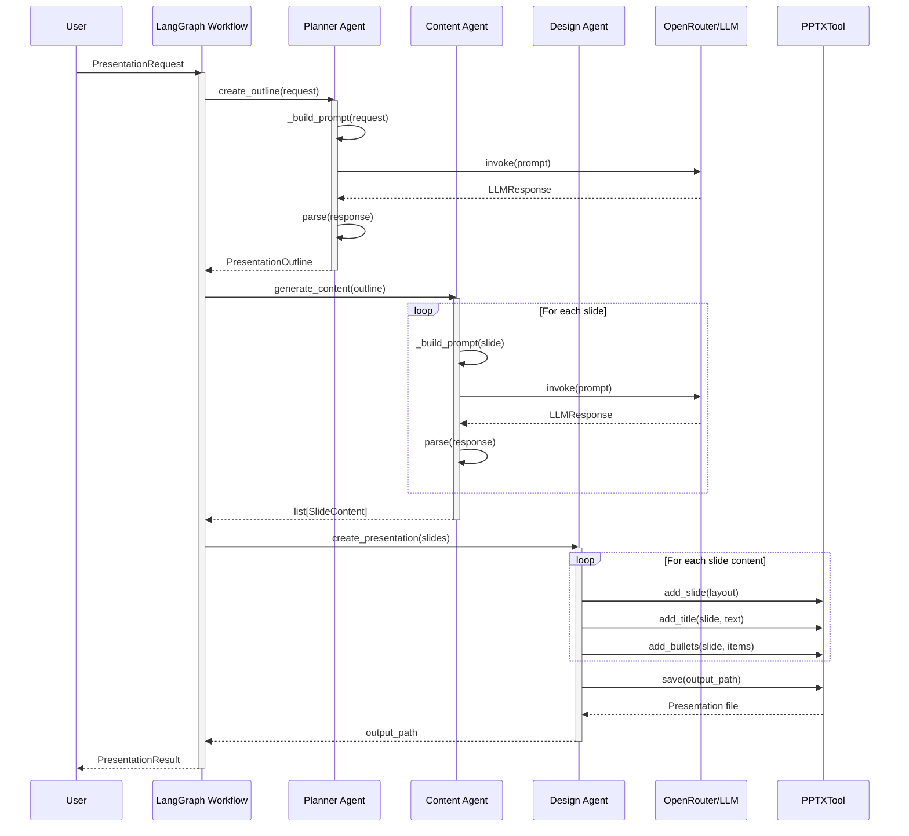
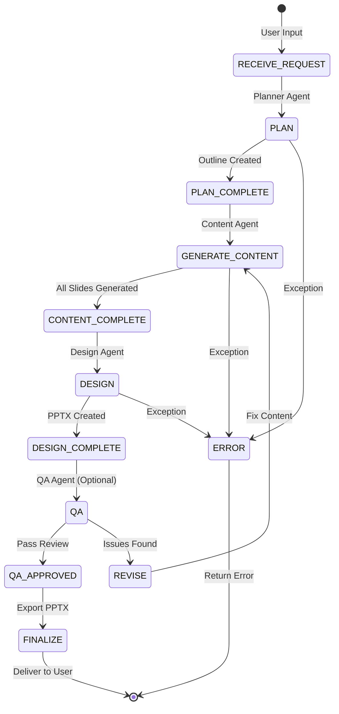
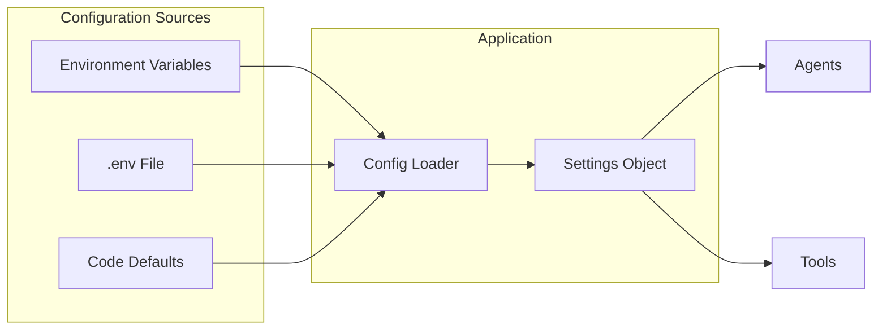

# AI PowerPoint Generator - Architecture Documentation

## Table of Contents

1. [Overview](#overview)
2. [Tech Stack](#tech-stack)
3. [System Architecture](#system-architecture)
4. [Component Diagrams](#component-diagrams)
5. [Data Flow](#data-flow)
6. [Agent Architecture](#agent-architecture)
7. [Design Patterns](#design-patterns)
8. [Directory Structure](#directory-structure)
9. [API Reference](#api-reference)
10. [Configuration](#configuration)

---

## Overview

The AI PowerPoint Generator is a multi-agent system that creates professional presentations using LLMs (via OpenRouter) and programmatic PowerPoint generation. It follows a modular, agent-based architecture with clear separation of concerns.

**Key Characteristics:**
- **Architecture Style:** Multi-Agent System with LangGraph orchestration
- **Pattern:** Chain of Responsibility (agents process sequentially)
- **Scaling:** Horizontal (add more agents) and Vertical (enhance agent capabilities)
- **Extensibility:** Plugin-based tool system
- **Async:** Fully asynchronous for optimal performance

---

## Tech Stack

### Core Technologies

| Layer | Technology | Purpose |
|-------|-----------|---------|
| **Language** | Python 3.10+ | Primary development language |
| **Package Manager** | uv | Fast Python package management |
| **Type Checking** | mypy | Static type analysis |
| **Linting** | ruff | Code formatting and linting |
| **Testing** | pytest | Unit and integration testing |

### AI/ML Stack

| Component | Library | Version | Purpose |
|-----------|---------|---------|---------|
| **LLM Interface** | langchain | ^0.1.0 | LLM abstraction layer |
| **LLM Provider** | langchain-openai | ^1.1.7 | OpenAI-compatible API |
| **Agent Orchestration** | langgraph | ^0.0.1 | State machine workflow |
| **LLM Gateway** | OpenRouter | API | Unified LLM access (Claude, GPT, etc.) |

### Data & Validation

| Component | Library | Purpose |
|-----------|---------|---------|
| **Data Models** | pydantic | Type-safe data validation |
| **State Management** | TypedDict | LangGraph state schemas |
| **Environment** | python-dotenv | Configuration management |

### PowerPoint Generation

| Component | Library | Purpose |
|-----------|---------|---------|
| **PPTX Engine** | python-pptx | PowerPoint file creation |
| **Image Processing** | Pillow (PIL) | Image manipulation |
| **Charts** | matplotlib/plotly | Data visualization |

### Development Tools

| Tool | Purpose |
|------|---------|
| **pytest** | Testing framework |
| **pytest-asyncio** | Async test support |
| **pytest-cov** | Coverage reporting |
| **pre-commit** | Git hooks |
| **black** | Code formatting |
| **ruff** | Fast Python linter |

---

## System Architecture

### High-Level Architecture



### Architecture Pattern: Multi-Agent Pipeline

```
┌─────────────┐     ┌─────────────┐     ┌─────────────┐     ┌─────────────┐
│   Request   │────▶│   Planner   │────▶│   Content   │────▶│   Design    │
│   (Input)   │     │   Agent     │     │   Agent     │     │   Agent     │
└─────────────┘     └─────────────┘     └─────────────┘     └─────────────┘
       │                   │                   │                   │
       ▼                   ▼                   ▼                   ▼
PresentationRequest   PresentationOutline   SlideContent[]    Presentation
```

---

## Component Diagrams

### 1. Agent System Architecture



### 2. Data Models



### 3. Tool System



---

## Data Flow

### 1. Request to Presentation Flow



### 2. State Transitions



---

## Agent Architecture

### Agent Communication Pattern

```mermaid
flowchart LR
    subgraph Input["Input Layer"]
        PR[PresentationRequest]
    end

    subgraph Agents["Agent Pipeline"]
        direction TB
        PA[PlannerAgent<br/>Creates Outline]
        CA[ContentAgent<br/>Generates Text]
        DA[DesignAgent<br/>Builds PPTX]
        QAA[QAAgent<br/>Validates]
    end

    subgraph Output["Output Layer"]
        PPTX[Presentation.pptx]
    end

    subgraph State["Shared State"]
        S1[Outline]
        S2[SlideContent[]]
        S3[Presentation]
    end

    PR --> PA
    PA -->|updates| S1
    S1 --> CA
    CA -->|updates| S2
    S2 --> DA
    DA -->|updates| S3
    S3 --> QAA
    QAA -->|validates| S3
    S3 --> PPTX
```

### Agent Responsibilities

| Agent | Input | Output | Key Responsibilities |
|-------|-------|--------|---------------------|
| **Planner** | PresentationRequest | PresentationOutline | Analyze request, research topic, create structure, define slide flow |
| **Content** | SlideOutline + context | SlideContent | Generate titles, write bullet points, create speaker notes, adapt tone |
| **Design** | SlideContent[] + theme | Presentation.pptx | Apply layouts, position elements, style slides, export file |
| **QA** | Presentation | QAReport | Validate completeness, check consistency, ensure quality |

---

## Design Patterns

### 1. Factory Pattern
```python
# LLM Creation Factory
class ChatOpenRouter(ChatOpenAI):
    """Factory for creating OpenRouter LLM instances."""
    
def create_llm(model=None, api_key=None, **kwargs) -> ChatOpenRouter:
    """Factory function for LLM instantiation."""
```

### 2. Strategy Pattern
```python
# Different layout strategies for different slide types
class LayoutStrategy(ABC):
    @abstractmethod
    def apply(self, slide: Slide, content: SlideContent) -> None:
        pass

class TitleLayout(LayoutStrategy): ...
class ContentLayout(LayoutStrategy): ...
class ImageLayout(LayoutStrategy): ...
```

### 3. Builder Pattern
```python
# PPTXTool uses builder pattern for slide creation
pptx_tool = PPTXTool()
slide = pptx_tool.add_slide("title_and_content")
pptx_tool.add_title(slide, "Title")
pptx_tool.add_bullets(slide, ["Point 1", "Point 2"])
pptx_tool.save("output.pptx")
```

### 4. Chain of Responsibility
```python
# Agents form a processing chain
class AgentPipeline:
    def __init__(self):
        self.agents = [
            PlannerAgent(),
            ContentAgent(),
            DesignAgent(),
        ]
    
    async def process(self, request):
        state = AgentState(request=request)
        for agent in self.agents:
            state = await agent.run(state)
        return state
```

### 5. State Machine (LangGraph)
```python
# Workflow defined as state transitions
graph = StateGraph(AgentState)
graph.add_node("planner", planner_step)
graph.add_node("content", content_step)
graph.add_node("design", design_step)
graph.add_edge("planner", "content")
graph.add_edge("content", "design")
graph.add_edge("design", END)
```

---

## Directory Structure

```
powerpoint-generator/
├── 📁 src/
│   ├── 📁 __init__.py
│   ├── 📁 agents/                    # Agent implementations
│   │   ├── __init__.py
│   │   ├── planner.py               # Outline creation
│   │   ├── content.py               # Text generation
│   │   ├── design.py                # Visual design
│   │   └── qa.py                    # Quality assurance
│   ├── 📁 config/                    # Configuration
│   │   ├── __init__.py
│   │   └── llm_config.py            # LLM setup (OpenRouter)
│   ├── 📁 models/                    # Data models
│   │   ├── __init__.py
│   │   ├── schemas.py               # Pydantic schemas
│   │   └── state.py                 # AgentState
│   ├── 📁 tools/                     # Utility tools
│   │   ├── __init__.py
│   │   ├── pptx_tool.py             # PowerPoint generation
│   │   └── chart_tool.py            # Chart creation (future)
│   ├── 📁 graph/                     # LangGraph workflow
│   │   ├── __init__.py
│   │   └── workflow.py              # State machine
│   └── 📁 design/                    # Design system (future)
│       ├── themes.py
│       └── layouts.py
│
├── 📁 tests/                         # Test suite
│   ├── __init__.py
│   ├── conftest.py                  # Pytest fixtures
│   ├── test_agents/                 # Agent tests
│   ├── test_models/                 # Model tests
│   └── test_tools/                  # Tool tests
│
├── 📁 examples/                      # Usage examples
│   ├── openrouter_usage.py          # Full example
│   └── quick_example.py             # Simple example
│
├── 📁 docs/                          # Documentation
│   ├── EVOLUTION_SPEC.md            # Evolution roadmap
│   └── openrouter.md                # Integration guide
│
├── 📁 templates/                     # PPTX templates (future)
│   ├── corporate/
│   ├── creative/
│   └── minimal/
│
├── 📁 output/                        # Generated presentations
│
├── 📄 pyproject.toml                 # Project configuration
├── 📄 AGENTS.md                      # Development guidelines
├── 📄 SPEC.md                        # Technical specification
├── 📄 TASKS.md                       # Task tracking
├── 📄 RESEARCH.md                    # Research findings
├── 📄 README.md                      # Project overview
├── 📄 .env.example                   # Environment template
└── 📄 .gitignore                     # Git ignore rules
```

---

## API Reference

### Public API

#### 1. LLM Configuration

```python
from src.config.llm_config import create_llm

# Create LLM instance
llm = create_llm(
    model="anthropic/claude-3.5-sonnet",
    temperature=0.7,
    max_tokens=2000
)
```

#### 2. Agent Usage

```python
from src.agents.planner import PlannerAgent
from src.agents.content import ContentAgent
from src.agents.design import DesignAgent

# Initialize agents
planner = PlannerAgent(llm=llm)
content_agent = ContentAgent(llm=llm)
design_agent = DesignAgent()

# Use agents
outline = await planner.create_outline(request)
slide_content = await content_agent.generate_slide_content(
    outline, audience="executives", style="professional"
)
presentation = design_agent.create_presentation(slides, output_path)
```

#### 3. Workflow Execution

```python
from src.graph.workflow import create_workflow

# Create workflow
workflow = create_workflow(planner, content_agent, design_agent)

# Execute
result = await workflow.ainvoke(initial_state)
```

#### 4. PPTX Tool

```python
from src.tools.pptx_tool import PPTXTool

# Create presentation
tool = PPTXTool(template_path="optional.pptx")
slide = tool.add_slide("title_and_content")
tool.add_title(slide, "My Title")
tool.add_bullets(slide, ["Point 1", "Point 2"])
tool.save("output.pptx")
```

### Data Models

```python
from src.models.schemas import (
    PresentationRequest,
    PresentationOutline,
    SlideContent,
)
from src.models.state import AgentState

# Create request
request = PresentationRequest(
    topic="AI Trends",
    audience="executives",
    goal="Inform about AI",
    num_slides=10,
    style="professional",
)

# Access state
state = AgentState(request=request)
```

---

## Configuration

### Environment Variables

| Variable | Required | Default | Description |
|----------|----------|---------|-------------|
| `OPENROUTER_API_KEY` | ✅ | - | OpenRouter API key |
| `OPENROUTER_MODEL` | ❌ | anthropic/claude-3.5-sonnet | Default LLM model |
| `OPENROUTER_SITE_URL` | ❌ | - | Site URL for rate limits |
| `OPENROUTER_SITE_NAME` | ❌ | - | Site name for tracking |
| `LOG_LEVEL` | ❌ | INFO | Logging level |
| `OUTPUT_DIR` | ❌ | ./output | Output directory |

### Configuration Flow



---

## Performance Considerations

### 1. Async Architecture
- All LLM calls are async for parallelization
- Agents can be run concurrently for independent slides
- I/O operations (file save) are non-blocking

### 2. Caching Strategy
```python
# Future: Cache LLM responses
@cache
async def generate_content(slide_outline):
    return await llm.ainvoke(prompt)
```

### 3. Resource Management
- PPTX files loaded in memory during creation
- Large presentations may need streaming
- Image optimization for size reduction

### 4. Scaling Options
- **Horizontal:** Add more agent workers
- **Vertical:** Use more powerful LLMs
- **Batch:** Process multiple presentations

---

## Security Considerations

1. **API Keys:** Stored in environment variables, never committed
2. **Input Validation:** Pydantic models validate all inputs
3. **File Safety:** Output paths sanitized to prevent traversal
4. **LLM Safety:** Content filtering through OpenRouter

---

## Future Architecture Evolution

### Phase 1: Current (MVP)
- Basic 3-agent pipeline
- Text-based slides
- Simple layouts

### Phase 2: Design System
- 10+ layout templates
- 5 design themes
- Typography system

### Phase 3: Visual Enhancement
- AI image generation
- Icon library
- Color palette automation

### Phase 4: Advanced Features
- Smart layout selection
- Data visualization
- Interactive elements

### Phase 5: Enterprise
- Multi-user support
- Template marketplace
- Analytics dashboard

---

## Appendix: ASCII Architecture Diagram

```
┌─────────────────────────────────────────────────────────────────┐
│                        AI PowerPoint Generator                   │
├─────────────────────────────────────────────────────────────────┤
│                                                                  │
│  ┌──────────┐     ┌──────────┐     ┌──────────┐                │
│  │  User    │────▶│  Request │────▶│ Workflow │                │
│  │  Input   │     │  Parser  │     │ Engine   │                │
│  └──────────┘     └──────────┘     └────┬─────┘                │
│                                         │                        │
│                    ┌────────────────────┼────────────────┐      │
│                    │                    ▼                │      │
│                    │  ┌──────────────────────────────────┐│      │
│                    │  │      AGENT PIPELINE             ││      │
│                    │  │                                 ││      │
│                    │  │  ┌─────────┐  ┌─────────────┐  ││      │
│                    │  │  │ Planner │─▶│   Content   │  ││      │
│                    │  │  │ Agent   │  │   Agent     │  ││      │
│                    │  │  └─────────┘  └──────┬──────┘  ││      │
│                    │  │                       │         ││      │
│                    │  │  ┌──────────────┐    │         ││      │
│                    │  │  │     Design   │◀───┘         ││      │
│                    │  │  │     Agent    │              ││      │
│                    │  │  └──────┬───────┘              ││      │
│                    │  └─────────┼──────────────────────┘│      │
│                    │            │                       │       │
│                    │  ┌─────────▼────────┐              │       │
│                    │  │   QA Agent       │              │       │
│                    │  │   (Optional)     │              │       │
│                    │  └─────────┬────────┘              │       │
│                    └────────────┼───────────────────────┘       │
│                                 │                                │
│                    ┌────────────▼────────┐                      │
│                    │    OUTPUT LAYER     │                      │
│                    │                     │                      │
│                    │  ┌───────────────┐  │                      │
│                    │  │ presentation  │  │                      │
│                    │  │    .pptx      │  │                      │
│                    │  └───────────────┘  │                      │
│                    └─────────────────────┘                      │
│                                                                  │
├─────────────────────────────────────────────────────────────────┤
│  EXTERNAL SERVICES: OpenRouter (LLM Gateway)                    │
│  TOOLS: PPTXTool, ImageTool, ChartTool                          │
└─────────────────────────────────────────────────────────────────┘
```

---

## Document Information

- **Version:** 1.0
- **Last Updated:** February 2025
- **Author:** AI PowerPoint Generator Team
- **Status:** Active Development

---

## Related Documents

- [AGENTS.md](../AGENTS.md) - Development guidelines
- [SPEC.md](../SPEC.md) - Technical specification
- [EVOLUTION_SPEC.md](./EVOLUTION_SPEC.md) - Future roadmap
- [openrouter.md](./openrouter.md) - Integration guide
